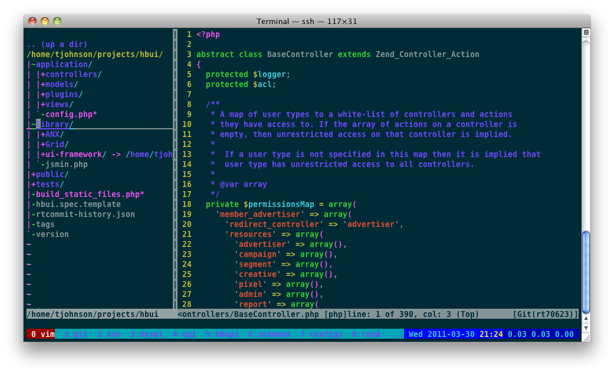
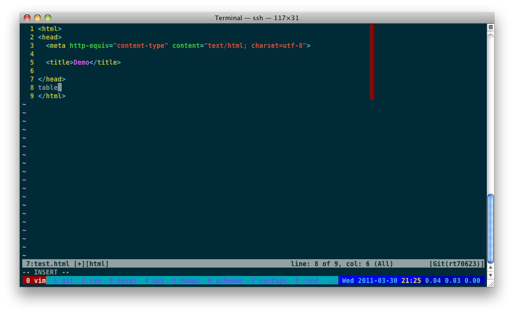
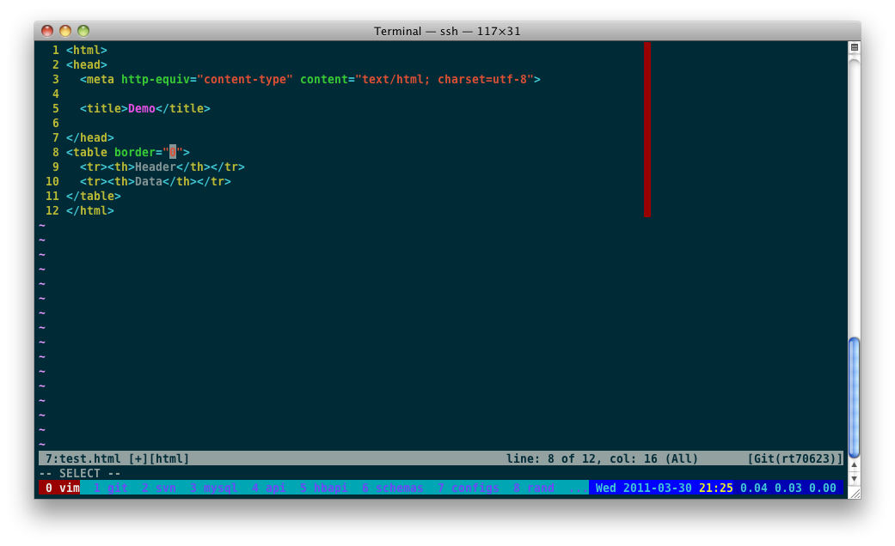
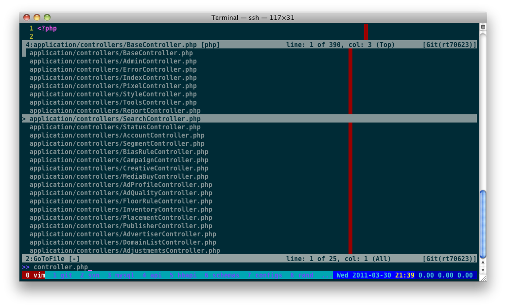

!SLIDE

# vim

	Vim is an advanced text editor that seeks 
	to provide the power of the de-facto Unix 
	editor 'Vi', with a more complete feature 
	set.

!SLIDE

# modes
* Normal mode: esc
* Visual mode: v, ctl-v, shift-v
* Insert mode: i, a, o, etc.
* Command-line mode: :

!SLIDE

# moving around in normal mode
* j, k, l, h - up, down, left, right
* ctrl-b, ctrl-f - page up, page down
* ctrl-e, ctrl-y - scroll down, scroll up
* gg, G - first line, last line
* ^, $ - beginning of line, end of line
* :100 - go to line 100
* w, b - forward one word, back one word
	
!SLIDE

# copy, paste, & delete
* yy - copy (yank)
* p - paste (put)
* dw - delete word
* d$ - delete to end of line
* dd - delete entire line
	
!SLIDE

# undo & redo
* u - undo last change
* ctrl-r - redo
	
!SLIDE

# search & search/replace
* /
* n, N - find next, find previous
* :s/search/replace/g - current line
* :%s/search/replace/g - entire file
	
!SLIDE

# open file
* :e path/to/file
* :sp path/to/file - horizontal split file
* :vsp path/to/file - vertical split file
	
!SLIDE

# save & quit
* :w - save
* :q - quit
* :wq - save & quit
* :q! - quit without saving
	
!SLIDE

# customizing vim
* ~/.vimrc
* plugins

!SLIDE

# plugins
* [Pathogen](https://github.com/tpope/vim-pathogen)
* [Nerdtree](https://github.com/scrooloose/nerdtree)
* [snipmate](https://github.com/msanders/snipmate.vim)
* [command-t](https://github.com/wincent/Command-T)

!SLIDE

# Nerdtree

!SLIDE

# Snipmate (before)

	
!SLIDE

# Snipmate (after)

	
!SLIDE

# Command-T

	
!SLIDE

# my entire .vim setup
### [https://github.com/travisj/dotvim](https://github.com/travisj/dotvim)
